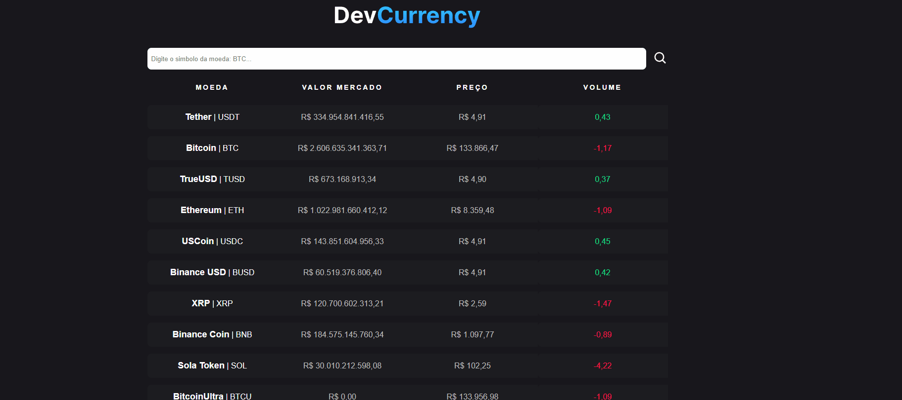

# Projeto criptomoedas
Este é um projeto de criptomoeda construído com React e TypeScript. Ele permite que os usuários visualizem gráficos de preços em tempo real e obtenham detalhes sobre diferentes criptomoedas.

## Funcionalidades
- Visualização de Gráficos: Os usuários podem visualizar gráficos de preços de criptomoedas em tempo real.
- Pesquisa de Criptomoedas: É possível pesquisar criptomoedas específicas para obter mais detalhes.
- Detalhes da Criptomoeda: Os usuários podem ver informações detalhadas sobre uma criptomoeda específica, incluindo preço atual, capitalização de mercado e volume.

[]

---

## Como utilizar
1 - Clone para o projeto

```
git clone https://github.com/rjunio98/criptomoedas.git
```

2 - Acessar a pasta
```
cd criptomoedas
```

3 - Instalar as dependências
```
npm install
```

4 - Executar o aplicativo
```
npm start
```

--- 

## Tecnologias Utilizadas
- HTML
- CSS
- JavaScript
- ReactJs
- Typescript
- Integração API
- Vite
- Git
- Vscode